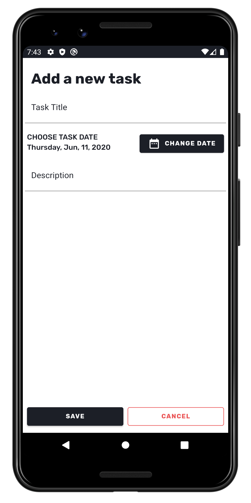

# Checked Android App (In Beta)
### A Minimalistic Android Todo app written in Kotlin
#### Kotlin, Room Database and Repository, Material Components, MVVM

 
Screenshots
---

  
  
  

Current Features
---
* Add and manage tasks
* Overview of all your tasks at a glance
* Set task due dates 
* Beautiful Material design and interface
* Dark Mode (Toggle Coming soon)
* Works offline, all data stored on your device

Planned Features
---
* Task notifications
* Multiple Task Lists
* Task Priority
* Task Tags
* Dark Mode Toggle/Settings Menu
* Overview customization
* Localization
* Themes - maybe

Known Issues
---
To report issues, please email me at peterdpongdev@gmail.com or add an issue to this github page.
* Edit task animation on close (Fixed in Beta 0.2)

Help with Translating
---
Email me at peterdpongdev@gmail.com to help with translating the app.

